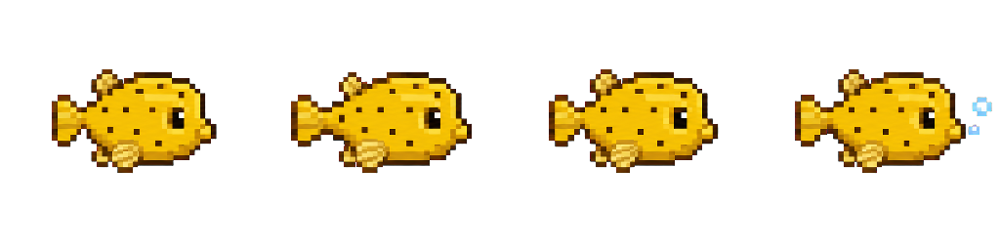
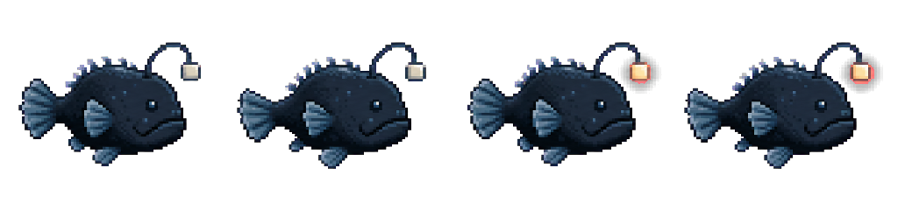
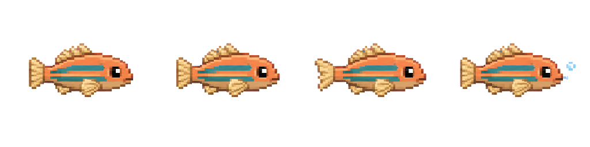
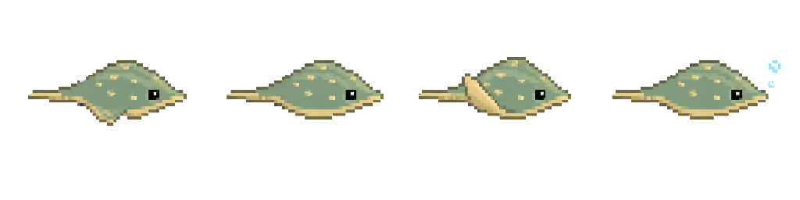
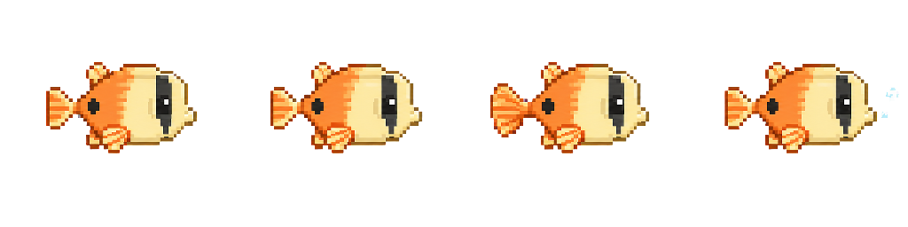

# 生き物スプライト案

`concept1.png` と `concept3.png` の静かな水中世界、低彩度の配色、輪郭の読みやすいドット絵を基準にした初期案。
現在は描画方式を確認するため、5種をアプリ本体へ試験接続している。量産用マスターではなく、見え方を評価するためのコンセプト素材として扱う。

- ミナミハコフグ案 → 既存の `shallow-puffer`（ぷくぷくフグ）
- キーアンコウ案 → 既存の `deep-lantern`（あかりアンコウ）
- しましまベラ案 → 既存の `shellfish`（しましまベラ）
- すなひかりエイ案 → 既存の `sand-ray`（すなひかりエイ）
- サンゴチョウチョウウオ案 → 既存の `coral-butterfly`（さんごチョウチョウウオ）

キーアンコウは深海実装時に独立種へ移す想定で、今回の割り当ては仮のもの。

## 共通仕様

- 透過 PNG
- Retina 向け 2 倍以上の解像度
- 1 セル `256 × 256px`（最大 `124 × 124 CSS px` 表示で約 2 倍密度）
- 4 コマ横並び、全体 `1024 × 256px`
- 全コマ右向き
- CSS の上下移動と、画像内のひれ・尾・発光の動きを分離する
- `prefers-reduced-motion` またはアプリ設定で、第 1 コマの静止画にできる構成

## 1. ミナミハコフグ



- ファイル: `minami-hakofugu-strip.png`
- 枠: 通常
- 配置候補: 珊瑚の森
- モチーフ: 実在するミナミハコフグの幼魚
- 動き: ゆっくり泳ぐ。最後のコマで小さな泡を 2 つ吐く
- 推奨速度: 1 周 `0.8〜1.2s`
- 図鑑文案: 「こどものころは、きいろい体に くろい水玉もよう。小さなひれで、ふわふわ泳ぐよ。」

黄色い水玉模様は幼魚に特徴的なため、図鑑では「こどもの姿」と明記する。

## 2. キーアンコウ



- ファイル: `key-angler-strip.png`
- 枠: レア
- 配置候補: 将来の深海
- モチーフ: 実在のアンコウを基礎に、提灯だけを無刻印のキーキャップ形にした創作種
- 動き: ゆっくり泳ぎ、3〜4 コマ目で提灯が控えめに明るくなる
- 推奨速度: 1 周 `1.2〜1.6s`
- 図鑑文案: 「キーの形の あかりを ゆらして、ことばの深海を ゆっくり泳ぐ。ふしぎなアンコウ。」

レア出現はタイピング速度や正確さ、連続ログインには結びつけない。
一定回数のプレイ内で必ず会える巡回方式にすると、この作品の穏やかな収集方針と合う。
実画面へ組み込む前に、濃紺背景でも 32px 表示を識別しやすいよう、本体の外周を一段明るい青灰へ調整する。

## 3. しましまベラ



- ファイル: `striped-wrasse-strip.png`
- 枠: 通常
- 配置: 潮だまり
- 動き: 尾びれを左右に振り、最後のコマで小さな泡を吐く
- 推奨速度: 1 周 `0.9〜1.2s`

橙色の体と青緑の横縞で、既存の丸い魚影と見分けやすい細長い姿にした。

## 4. すなひかりエイ



- ファイル: `sand-ray-strip.png`
- 枠: 通常
- 配置: 浅瀬
- 動き: 左右のひれを上下させ、最後のコマで小さな泡を吐く
- 推奨速度: 1 周 `1.0〜1.4s`

砂色の縁と淡い斑点を持つ、上から少し見下ろした菱形のシルエット。

## 5. サンゴチョウチョウウオ



- ファイル: `coral-butterfly-strip.png`
- 枠: 通常
- 配置: 珊瑚の森
- 動き: 尾びれを左右に振り、最後のコマで小さな泡を吐く
- 推奨速度: 1 周 `0.9〜1.2s`

クリーム色と珊瑚色、目を通る濃い帯を使い、珊瑚の森で読める明るい配色にした。

## 実装時のデータ案

```js
{
  rarity: "common",
  sprite: {
    file: "minami-hakofugu-strip.png",
    frames: 4,
    frameMs: 250,
    sourceFacing: "right"
  }
}
```

- `FISH_SPECIES` 側だけに `rarity` と `sprite` を追加し、捕獲個体やセーブには画像 URL、向き、現在コマを保存しない。
- スプライト未設定の魚は、現在の CSS 図形へフォールバックさせる。
- 位置決め、上下の遊泳、コマ送り、左右反転を別の要素に分ける。`transform` の競合を避けられる。
- `background-size: 400% 100%` で表示し、4 コマの `background-position-x` を切り替える。
- `image-rendering: pixelated` を指定する。
- 第 1 コマを静止画として使い、アプリ設定と `prefers-reduced-motion` の両方でアニメーションを停止する。

## 既存データとの関係

- `src/domain/fish.js` には `shallow-puffer`（ぷくぷくフグ）がある。試験導入ではミナミハコフグ案をその見た目として使えるが、図鑑名を実在種へ変える場合は問題内容と海域を再確認する。
- 同ファイルには、旧セーブ互換用の `deep-lantern`（あかりアンコウ）がある。ID の変更や削除はしない。
- キーアンコウを新種として追加するなら、既存のあかりアンコウと役割が重ならないよう、深海追加時に `key-angler` として登録するのが安全。

## 生成方法とプロンプト

組み込みの画像生成を使用。`concept1.png` と `concept3.png` は画風・密度の参照画像とし、UI は生成対象に含めなかった。

- ミナミハコフグ: 「実在する幼魚、右向き、泳ぎ 3 コマ＋泡 1 コマ、低彩度の黄・濃紺・砂色、64px で読める硬いドット、4 等分の横一列、同じ基準線」
- キーアンコウ: 「実在のアンコウを基礎に、無刻印のキーキャップ形の提灯だけを創作要素にする。右向き、泳ぎ 2 コマ＋弱い発光 2 コマ、低彩度の青灰と黄土、4 等分の横一列、同じ基準線」
- しましまベラ: 「右向き、橙色の細長い体、青緑の横縞、尾びれの動き 3 コマ＋泡 1 コマ、4 等分の横一列」
- すなひかりエイ: 「右向き、砂色と海緑の菱形、ひれの上下 3 コマ＋泡 1 コマ、4 等分の横一列」
- サンゴチョウチョウウオ: 「右向き、クリーム色と珊瑚色、濃い目帯、尾びれの動き 3 コマ＋泡 1 コマ、4 等分の横一列」
- 共通制約: 「文字・UI・影・3D・過剰な発光を入れない。単色クロマキー背景、同じピクセルグリッド、1 セルに 1 匹」

組み込みの画像生成で作った高解像度原画から直接クロマキーを透過へ変換し、最近傍補間で `1024 × 256px` に書き出した。小さい画像を再拡大していないため、原画の大きなドットと輪郭を維持している。輪郭色とマゼンタ背景が干渉した2種は、魚体色を保護するため純青背景で再生成した。
現在の画像はコンセプト確認用として半透明の縁を残している。量産用マスターでは色数とアルファを整理し、硬いドットの輪郭へ揃える。
